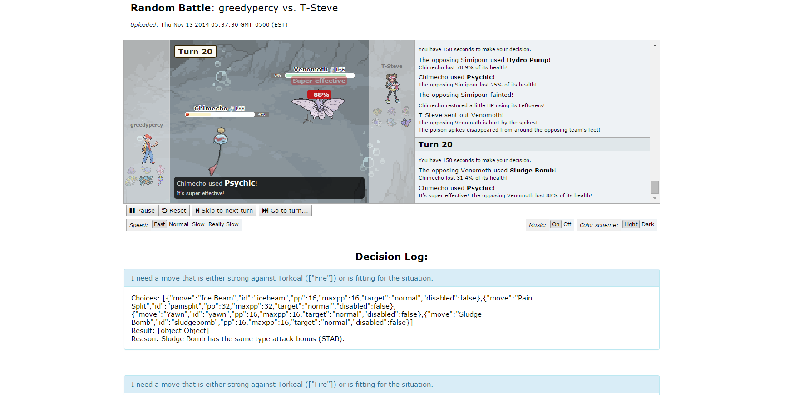

# Percymon: A Pokemon Showdown AI

> This project was built for an old version of Pokemon Showdown and won't work with newer versions. You might have luck checking out some of the forks.
> - https://github.com/shingaryu/showdownbot
> - https://github.com/amharfm/percymon-gen7
> - [More Forks](https://github.com/rameshvarun/showdownbot/forks?include=active&page=1&period=&sort_by=stargazer_counts)

Percymon is a Pokemon battling AI that runs on the Pokemon Showdown server. Percymon is built using Node.js.

## Setting up the repository

To set up the server, you need to first install dependencies:

    npm install

In order to actually play games you must create an account on Pokemon Showdown. Once the log-in information has been obtained, you need to create an `account.json` file containing information. The format of `account.json` is as follows:

    {
        "username" : "sillybot",
        "password": "arbitrary password",
        "message" : "gl hf"
    }

The `message` field indicates the message that will be sent when the bot first connects to the game.

Finally, to start the server, issue the following command:

    node bot.js

By default, the server searches for unranked random battles when the option is toggled in the web console. There are several command line options that can be supplied:

    --console: Only start the web console, not the game playing bot.
    --host [url]: The websocket endpoint of the host to try to connect to. Default: http://sim.smogon.com:8000/showdown
    --port [port]: The port on which to serve the web console. Default: 3000
    --ranked: Challenge on the ranked league.
    --net [action]: Neural network configurations. 'create' - generate a new network. 'update' - use and modify existing network. 'use' - use, but don't modify network. 'none' - use hardcoded weights. Default: none
    --algorithm [algorithm]: Can be 'minimax', 'greedy', or 'random'. Default: minimax
    --account [file]: File from which to load credentials. Default: account.json
    --nosave: Don't save games to the in-memory db.
    --nolog: Don't append to log files.
    --startchallenging: Start out challenging, instead of requiring a manual activation first.
